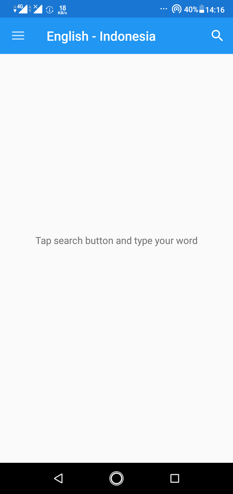
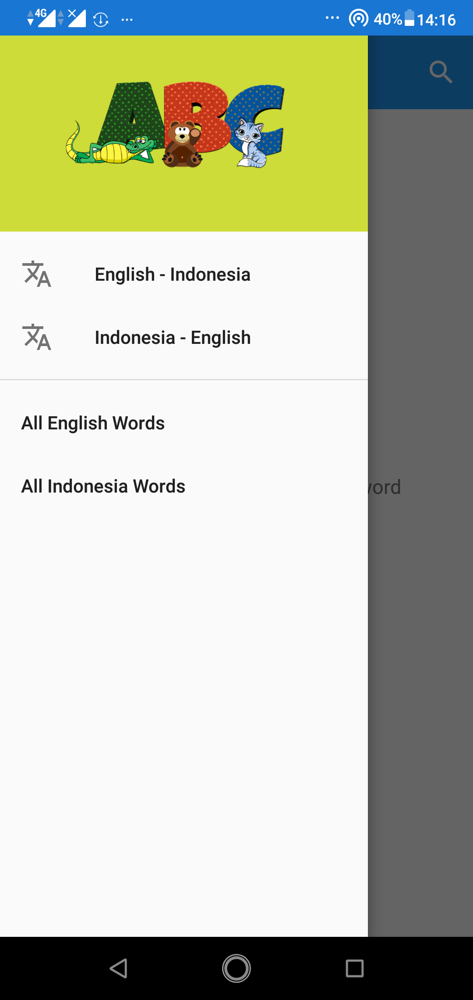
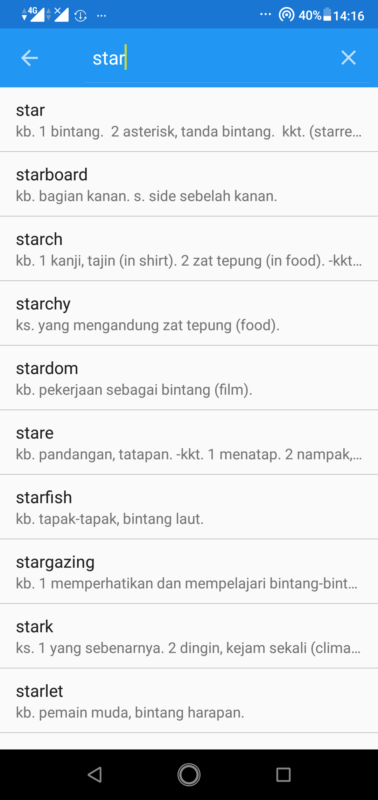
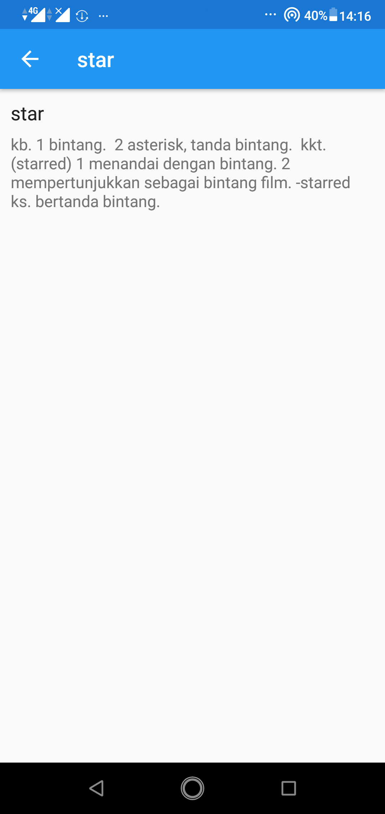
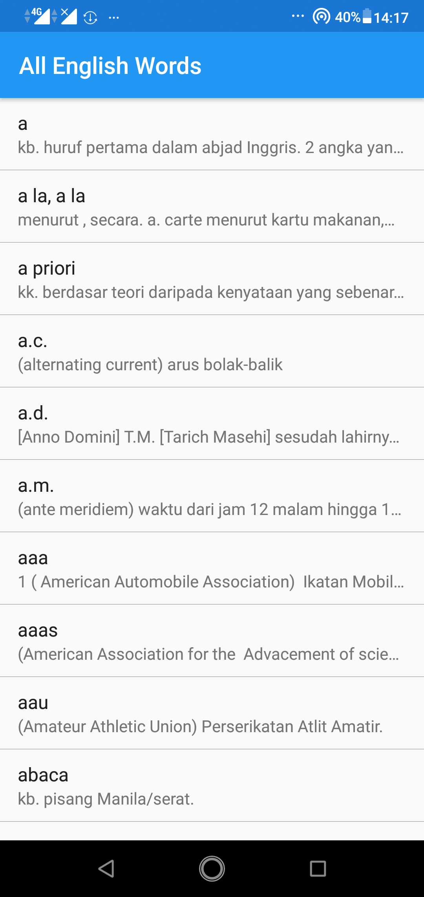
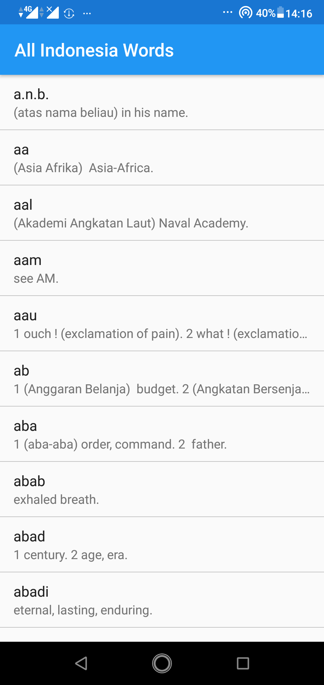

<h1 align="center">
Kamus Offline
</h1>
This is my submission 4 at Dicoding online course at class Belajar Fundamental Aplikasi Android www.dicoding.com/academies/14

## Screenshots

  
  
  
  
  
  

## Features

1. Search English and Indonesian words.
2. Detail search result.
3. Display all English and Indonesian words.

## Tech Stack
- [x] Java
- [x] SQLite

## Apps
<a href="https://drive.google.com/file/d/1j-gUNPHwxXDmN5-09BIwYixkuPldBvIJ/view?usp=sharing" title="Kamus Offline Apps">Download Here</a>

## Author
| [ <b>Alvin Tandiardi</b>](https://github.com/alvintan05)  |
| :-----------------------------------------------------------------------------------------------------------------------------------------------------------------: |
